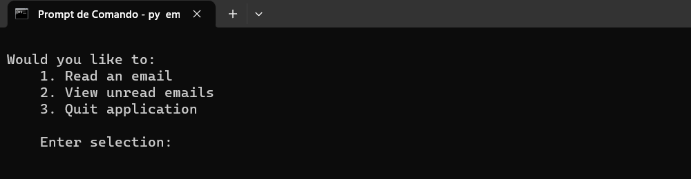

# email.py

## This is a oriented object program that uses a class to simulate the storage and manipulation of mail objects

This program is importante do demonstrate some uses of
class manipulation

## Instalation

- With Python **([Download here](https://www.python.org/downloads/))** installed on your computer open the terminal and run the following command to generate a clone of the project:

```bash
git clone https://github.com/humbertoangeli/finalCapstone
```

- Run the program with the command:
```bash
py email.py
```

- A screen with the following menu will appear:



- Type 1 for the first option and the following menu will appear:

- 
