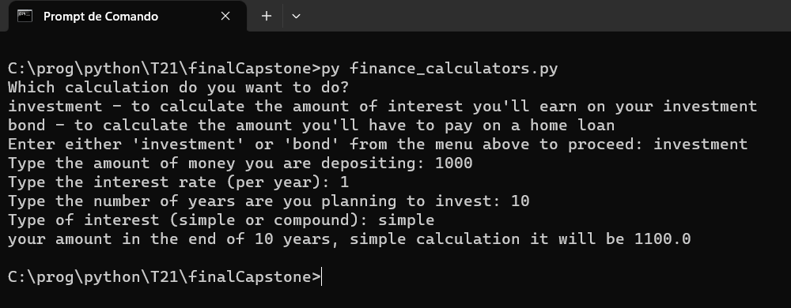

# finance_calculators project

## This program does some financial calculations

The importance of this program is the use of defensive programming with many manipulations of strings and numbers
and interations with the user

## Instalation

- With Python **([Download here](https://www.python.org/downloads/))** installed on your computer open the terminal and run the following command to generate a clone of the project:

```bash
git clone https://github.com/humbertoangeli/finalCapstone
```

- Run the program with the command:
```bash
py finance_calculators.py
```
## Usage

- When the program starts, a screen with the following menu will appear:


- As an example, type 'investment' to simulate a calculation with the following parameters showing on the image below (simple rate method):



- As another example, type 'investment' to simulate a calculation with the following parameters showing on the image below (compound rate method):


- On the last example, type 'bond' to simulate an installment like the image below:


## Credits

Humberto de Angeli, HyperionDev Team
