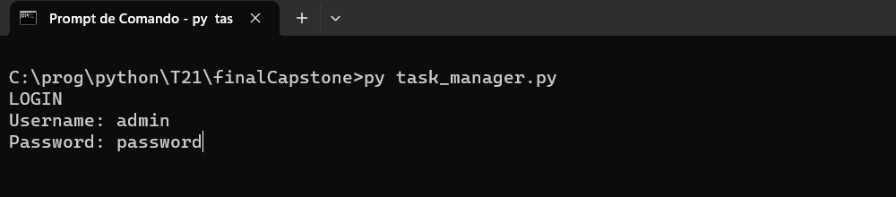
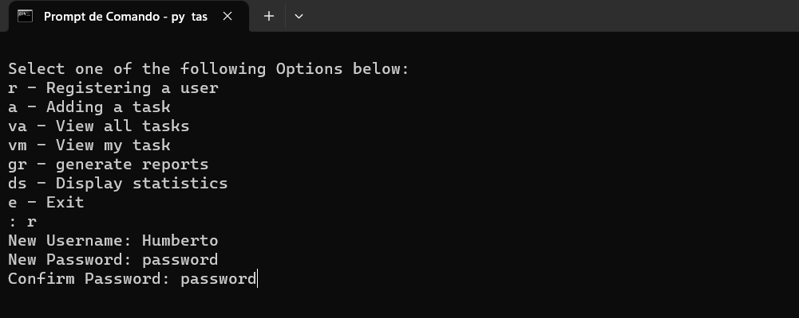
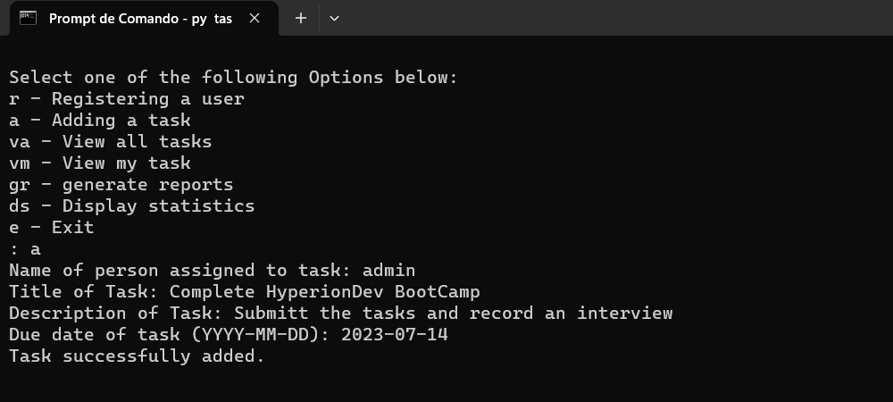
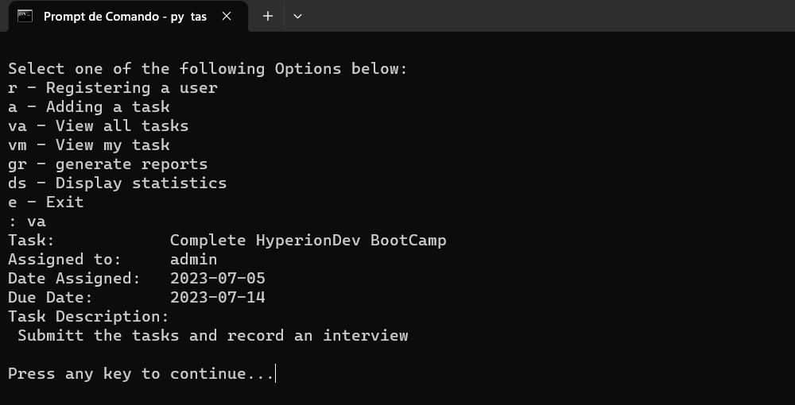
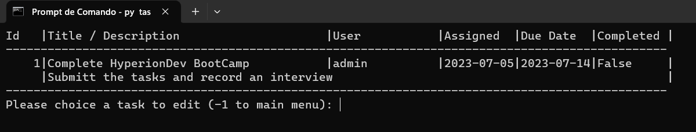
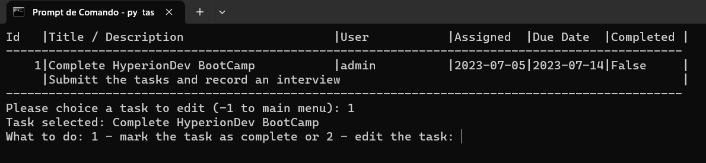
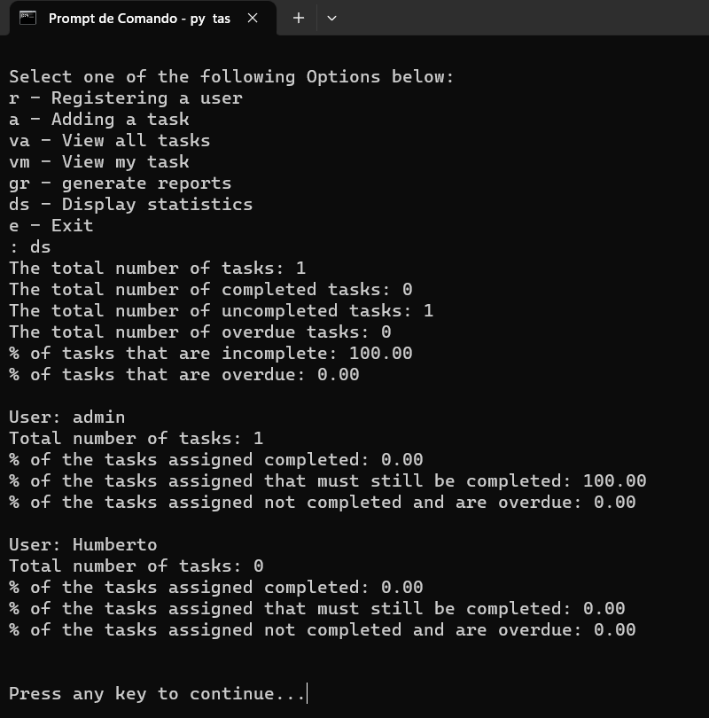

# task_manager project

## This program is a capstone of the Hyperion BootCamp. It is a task manager with options for creating a task and editing with user control. Both users and tasks are recorded in a text file.

This program consolidates many of the techniques learned in BootCamp, from defensive programming, code blocks, file and variable manipulation, and data structure management.

## Instalation

- With Python **([Download here](https://www.python.org/downloads/))** installed on your computer open the terminal and run the following command to generate a clone of the project:

```bash
git clone https://github.com/humbertoangeli/finalCapstone
```

- Run the program with the command:
```bash
py finance_calculators.py
```
## Usage

- When the program starts, a screen with the following menu will appear:



- As an example, type **'investment'** to simulate a calculation with the following parameters showing on the image below (simple rate method):



- As another example, type **'investment'** to simulate a calculation with the following parameters showing on the image below (compound rate method):



- On the last example, type **'bond'** to simulate an installment like the image below:



- On the last example, type **'bond'** to simulate an installment like the image below:



- On the last example, type **'bond'** to simulate an installment like the image below:



- On the last example, type **'bond'** to simulate an installment like the image below:



## Credits

Humberto de Angeli, HyperionDev Team
